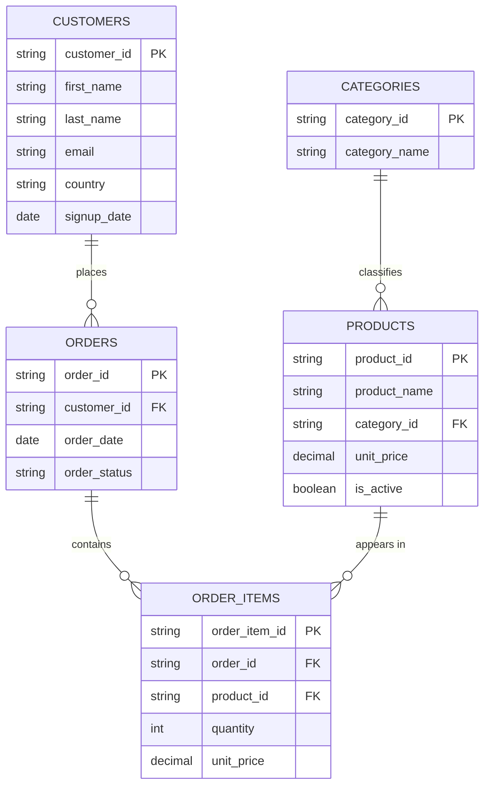
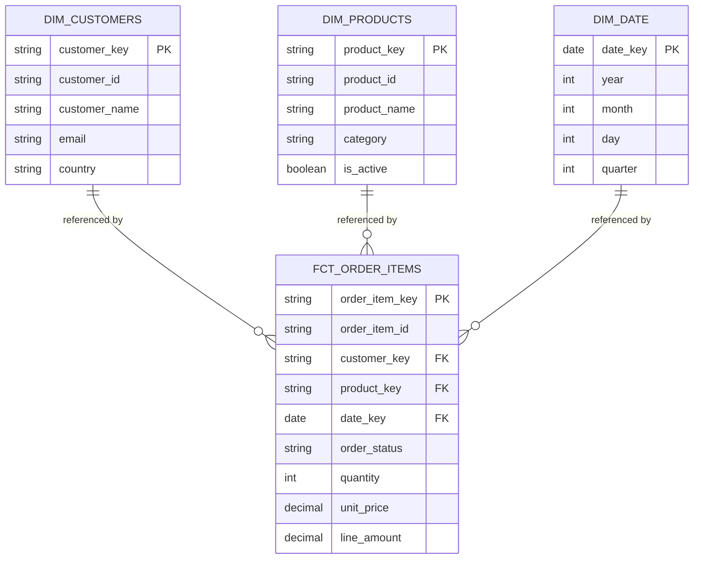
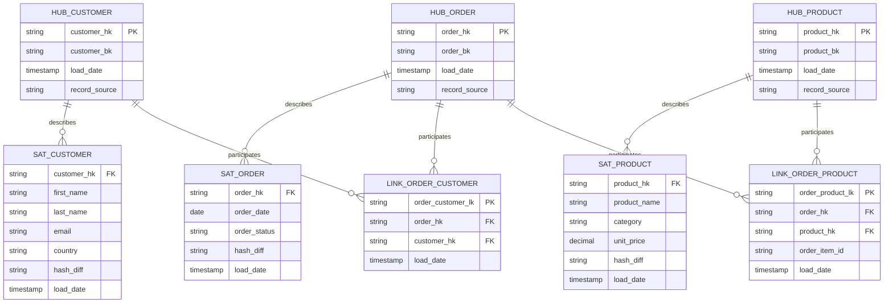

# Data Modeling Playbook

Reference repo comparing modeling approaches **3NF**, **Kimball star schema**, and **Data Vault 2.0** built from the **same source dataset**, plus decision guidance on when to use each.

**Stack:** SQL · dbt · ERD diagrams (runs locally on DuckDB no cloud account needed)

Most modeling resources explain one approach in isolation. This repo builds **all three from identical source data** so the differences are concrete.

```
                          ┌───────────────┐
                          │  Same raw data│
                          │  (seeds/)     │
                          └───────┬───────┘
                                  │
                          ┌───────┴───────┐
                          │  Staging layer│  <- shared, identical for all three
                          └───────┬───────┘
              ┌───────────────────┼───────────────────┐
              ▼                   ▼                   ▼
      ┌───────────────┐  ┌───────────────┐  ┌───────────────────┐
      │  models/nf3/  │  │models/kimball/│  │ models/data_vault/│
      │ 3NF normalized│   Star schema    │  │ Hubs/Links/Sats   │
      └───────────────┘  └───────────────┘  └───────────────────┘
```

---

## Comparison

| | **3NF** | **Kimball Star Schema** | **Data Vault 2.0** |
|---|---|---|---|
| **Optimized for** | Transactional integrity, storage efficiency | Query performance, BI/reporting simplicity | Auditability, historization, source agility |
| **Structure** | Fully normalized, minimal redundancy | Denormalized dimensions + fact tables | Hubs (keys), Links (relationships), Satellites (attributes + history) |
| **Query complexity** | High many joins for reporting | Low 1/2 joins, intuitive for analysts | High more joins than Kimball, but consistent pattern |
| **Handles source schema changes** | Poorly normalization is brittle to change | Moderately dimensions need rebuilding | Well new sources add new satellites, no rework of existing structures |
| **History tracking** | Not built in requires manual SCD logic | SCD Type 1/2 on dimensions (manual pattern) | Built into the model every satellite row is a historized fact |
| **Best team fit** | OLTP systems, small reporting needs | Analytics engineering teams building BI facing marts | Large orgs with many source systems, compliance/audit needs |
| **Learning curve** | Familiar to anyone who's learned relational DBs | Low widely taught, intuitive for consumers | Steep hub/link/satellite pattern takes time to internalize |

---

## Project Structure

```
data-modeling-playbook-dbt/
├── dbt_project/
│   ├── seeds/                  # Shared raw source data (CSV) identical input for all 3 models
│   ├── models/
│   │   ├── staging/            # Shared cleaning layer (1:1 with seeds)
│   │   ├── nf3/                # 3NF: customers, categories, products, orders, order_items
│   │   ├── kimball/            # Star schema: dim_customers, dim_products, dim_date, fct_order_items
│   │   └── data_vault/            # Hubs, Links, Satellites
│   ├── dbt_project.yml
│   └── profiles_example.yml    # DuckDB profile no cloud warehouse required
├── erd_diagrams/               # One ERD per approach, in Mermaid
│   ├── erd_3nf.md
│   ├── erd_kimball.md
│   └── erd_data_vault.md
└── docs/
    ├── decision_guide.md       # Deep-dive: when to use which approach, and why
    └── setup_guide.md
```
---

## ERD Diagrams

Each approach has its own entity relationship diagram, written in Mermaid.

# 3NF Entity Relationship Diagram



**Key characteristic:** every entity is normalized `category_name` lives only in `CATEGORIES`, order level attributes live only in `ORDERS`. Reporting on "revenue by category" requires joining all five tables.

# Kimball Star Schema Entity Relationship Diagram



**Key characteristic:** `category` is denormalized directly onto `DIM_PRODUCTS` no join to a separate categories table needed. "Revenue by category" is one join (fact → dim_products), not four.

# Data Vault 2.0 Entity Relationship Diagram


**Key characteristic:** business keys (Hubs) are structurally separated from relationships (Links) and descriptive attributes (Satellites). Every satellite row carries a `load_date` and `hash_diff` new attribute values are always inserted as new rows, never overwritten, so full history is preserved by construction rather than by a manual SCD Type 2 pattern.

---
